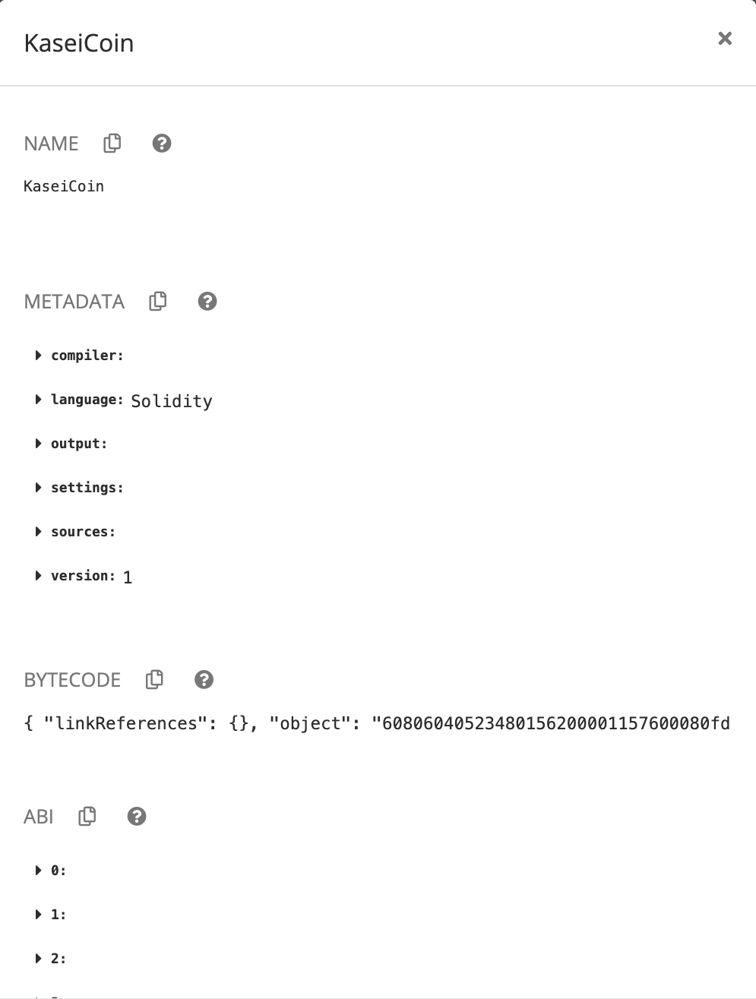
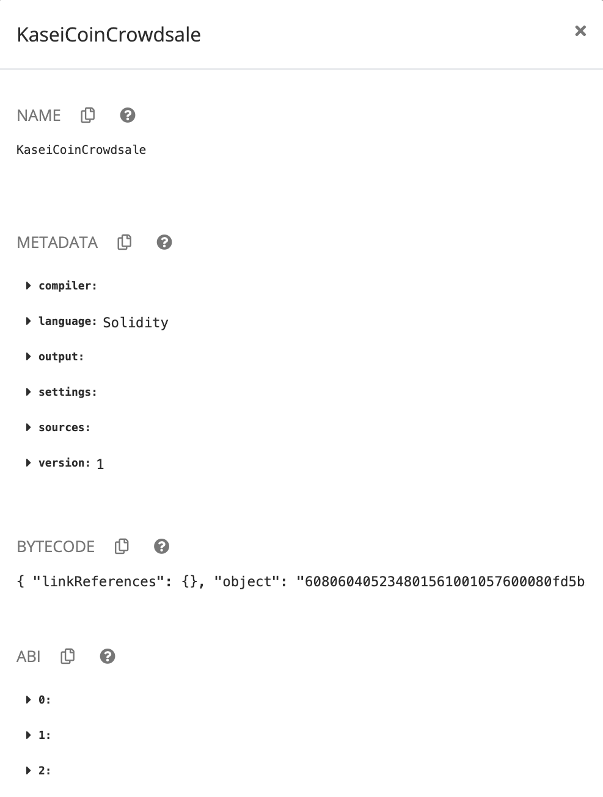
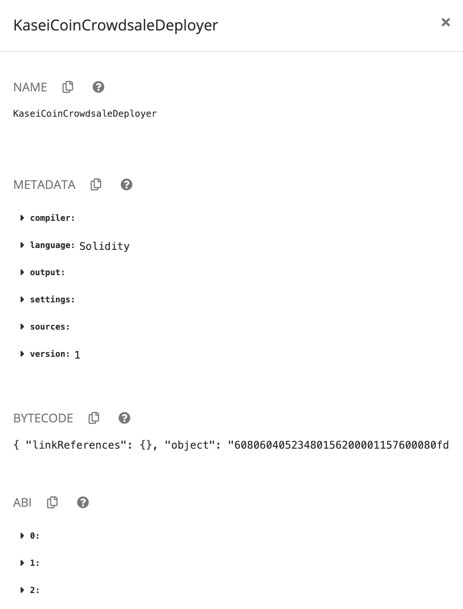
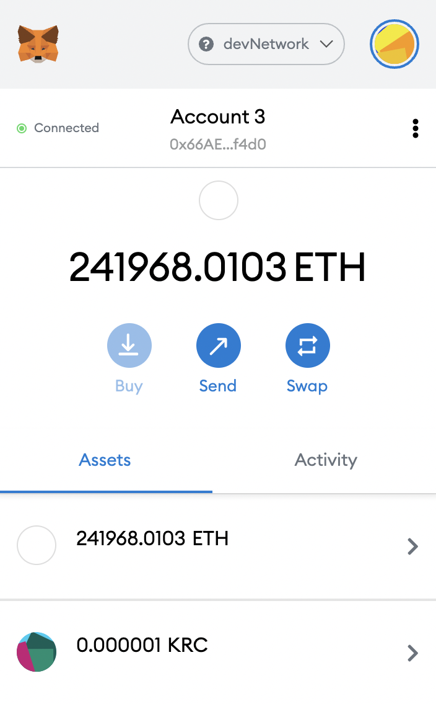
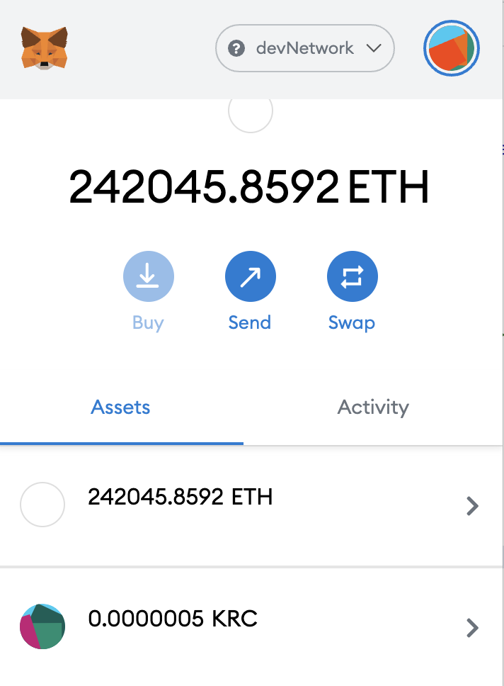

# KaseiCoin Tokenomics 

---

## Technologies

All technology utilized in this module is encompassed in the [Remix Ethereum IDE](https://remix-project.org/), _Ganache_, and _MetaMask_. 

---

## Installation Guide

No installation required; all development and demos are hosted in the _Remix Ethereum IDE_, _Ganache_, and _MetaMask_.

---

## Evaluation Evidence 

This section entails evidence of successful compilation and deployment of KaseiCoin and related contracts.

---

### KaseiCoin Token Contract 

---

### KaseiCoin Crowdsale Contract

---

### KaseiCoin Deployer Contract 

---

### Local Blockchain Crowdsale Deployment

---

### Crowdsale Functionality

---

## Usage

Upload the `KaseiCoin.sol` and `KaseiCoinCrowdsale.sol` files into the Remix Ethereum IDE and compile. 

---

## Contributors

New development created by Aaron C. Montano. **Code from 'Initial commit.' commit originates from UC Berkeley Extension and I do not claim original ownership nor scholarship**.

---

## License

Software tool available for public use. 
